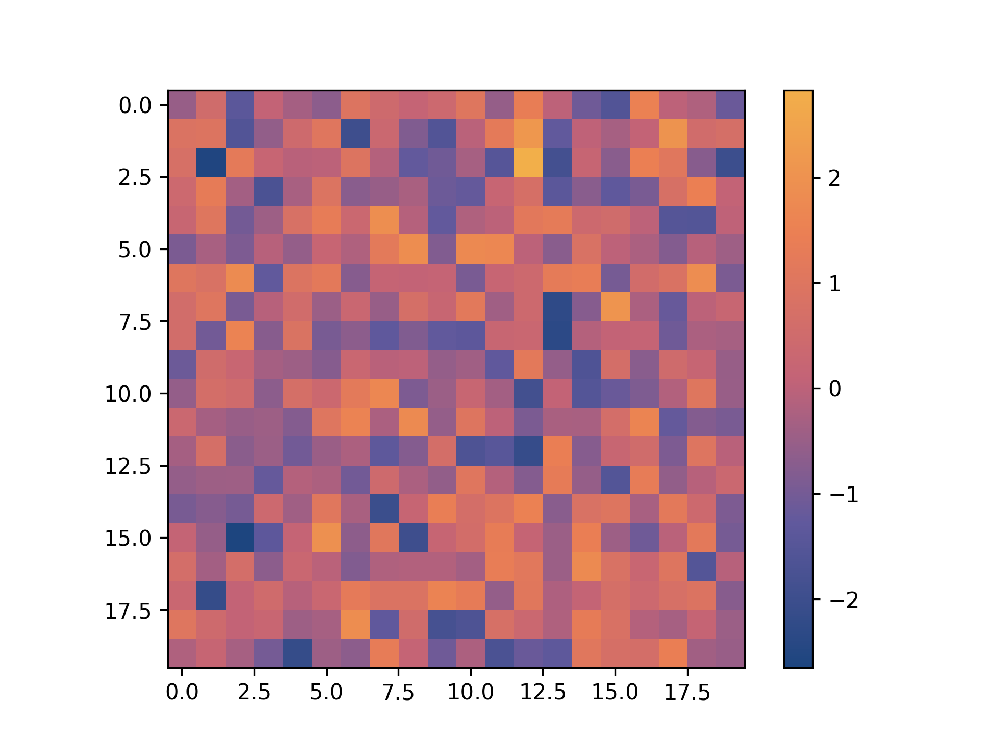
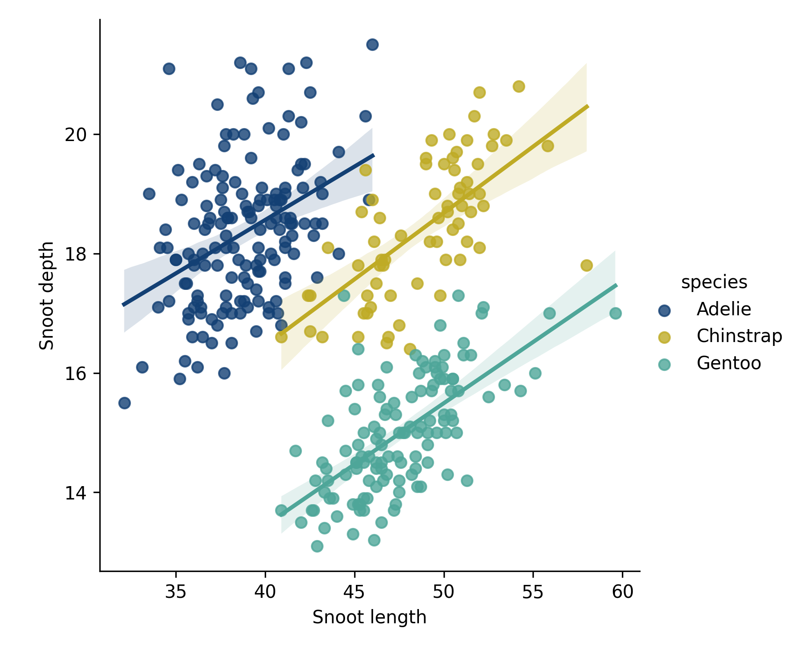
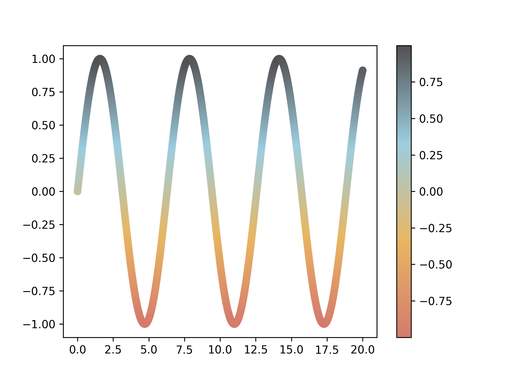

# PyPalettes

>[!NOTE]
> PyPalettes is supported by [Matplotlib Journey](https://www.matplotlib-journey.com/), an interactive online course designed to make you a master of Matplotlib. If you want to **support PyPalettes** and **become a Matplotlib expert**, consider purchasing the course!
>
> This package is based on the R package [paletteer](https://github.com/EmilHvitfeldt/paletteer), and all associated sub-packages (with original palettes) mentioned in the [LICENSE](LICENSE.note) file.
>
> This project is forked from [JosephBARBIERDARNAL/pypalettes](https://github.com/JosephBARBIERDARNAL/pypalettes)

A large (**+2500**) collection of color maps for Python.

- All available palettes can be found in the [Color Palette Finder](https://python-graph-gallery.com/color-palette-finder/).
- To learn more about how to use `pypalettes`, please refer to the [official documentation](https://python-graph-gallery.com/introduction-to-pypalettes/).


## Installation

With pip:

```bash
pip install git+https://github.com/jshn9515/pypalettes.git
```

## Quick start

Once `pypalettes` is imported, all the palettes are now accessible as any other colormap in matplotlib or seaborn via the `palette` or `cmap` arguments.

### Continuous palette

```python
import matplotlib.pyplot as plt
import numpy as np

from pypalettes import get_cmap

data = np.random.randn(20, 20)
cmap = get_cmap('Sunset2', cmap_type='continuous')

plt.imshow(data, cmap=cmap)
plt.colorbar()
plt.show()
```



### Categorical palette

```python
import matplotlib.pyplot as plt
import seaborn as sns

from pypalettes import get_cmap

df = sns.load_dataset('penguins')
cmap = get_cmap('Fun')

g = sns.lmplot(
    data=df,
    x='bill_length_mm',
    y='bill_depth_mm',
    hue='species',
    palette=cmap,
)
g.set_axis_labels('Snoot length', 'Snoot depth')
plt.show()
```



### Your own palette

```python
import matplotlib.pyplot as plt
import numpy as np

from pypalettes import add_cmap

cmap = add_cmap(
   name='my_cmap',
   cmap_type='continuous',
   colors=['#D57A6DFF', '#E8B762FF', '#9CCDDFFF', '#525052FF'],
)

x = np.linspace(0, 20, 1000)
y = np.sin(x)

plt.scatter(x, y, c=y, cmap=cmap)
plt.colorbar()
plt.show()
```



## Features

- Add +2500 native palettes to matplotlib and seaborn
- Load, customise and combine +2500 palettes
- Create your own palettes

To find out more about using PyPalettes, use this [PyPalettes guide](https://python-graph-gallery.com/introduction-to-pypalettes/).

## Acknowledgements

`PyPalettes` is **highly** inspired (and relies on for the first one) from

- the R package [paletteer](https://github.com/EmilHvitfeldt/paletteer)
- the python library [palettable](https://github.com/jiffyclub/palettable)

A big thanks to [Yan Holtz](https://www.yan-holtz.com/) for:

- Creating the [web app for browsing palettes](https://python-graph-gallery.com/color-palette-finder/)
- Hosting the [documentation](https://python-graph-gallery.com/introduction-to-pypalettes/) and examples on the **Python Graph Gallery**
- Providing valuable feedback on the code and design of the API

## Contributing

Since the core code of the library is currently quite short and simple, it does not require any major changes. However, if you have a good idea or suggestion, please [open an issue](https://github.com/JosephBARBIERDARNAL/pypalettes/issues).

That said, adding more palettes is an easy way to make `pypalettes` better! Here’s the best way to get started:

First, open your code editor and navigate to `parsers/list_manual_palettes.py`. You’ll find a dictionary of manually defined palettes. Add yours at the end with the following elements:

- `"name"`: the name of your palette
- `"palette"`: the colors of your palette in the following format: `"['#123456', '#654321', '#162534']"`
- `"source"`: Where does your palette come from? If you created it, your name or a link to your portfolio is valid!
- `"kind"`: the type of palette. View examples [here](https://python-graph-gallery.com/color-palette-finder/)
- `"paletteer-kind"`: just put `"unknown"`

Then, run:

```bash
python parsers/main.py
```

For a large number of palettes, please [open an issue](https://github.com/JosephBARBIERDARNAL/pypalettes/issues) first.
